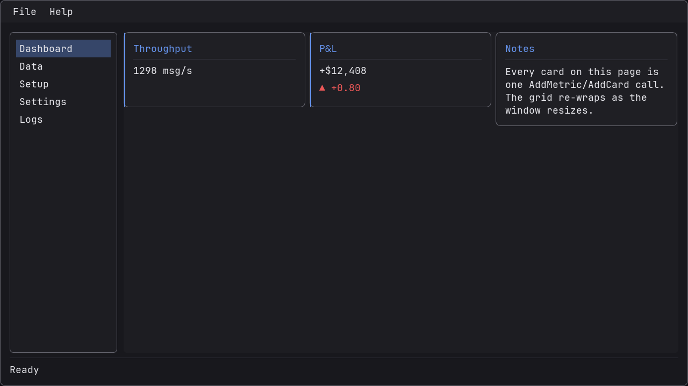

# TeamkillerUniGUI — 现代化 Dear ImGui C++ 封装库

[](https://en.cppreference.com/w/cpp/23)
[](https://cmake.org/)
[](https://vcpkg.io/)
[]()
[]()
[]()
[]()
[]()

C++23 Dear ImGui 封装库——提供统一的明暗主题引擎、高层组件、声明式 DSL、CSS 样式引擎、插件系统与 EventBus。支持 7 种渲染后端：GLFW+OpenGL3、SDL3+Vulkan、DX11、DX12、Metal、WebGPU 和 Emscripten。



*[`examples/preset_demo`](examples/preset_demo/main.cc)：[AppShell](docs/PRESETS.md) 脚手架（菜单栏、侧边导航、状态栏、Ctrl+P 命令面板）承载 Dashboard 预设，入口由 LoginPage 登录页守卫——应用代码约六十行。*

## 快速开始

### Windows：一条命令（推荐）

```powershell
git clone https://github.com/Teamkiller131/TeamkillerUniGUI.git
cd TeamkillerUniGUI

# 先自检工具链（Visual Studio / CMake / Ninja / vcpkg）：
pwsh -File scripts/check_env.ps1

# 一次完成配置 + 构建 +（可选）测试：
pwsh -File scripts/build.ps1                       # release 构建
pwsh -File scripts/build.ps1 -Preset windows-msvc-debug -Test
pwsh -File scripts/build.ps1 -Clean                # 全新构建目录
```

`build.ps1` 会先运行环境自检，再通过 `cmake-msvc.cmd` 驱动构建，
确保 MSVC 工具集始终被正确锁定。

### 手动步骤

```bash
git clone https://github.com/Teamkiller131/TeamkillerUniGUI.git
cd TeamkillerUniGUI

# Windows MSVC：使用 cmake-msvc.cmd 包装器以正确配置 MSVC 环境
cmake-msvc.cmd --preset windows-msvc-release
cmake-msvc.cmd --build --preset windows-msvc-release
ctest --preset windows-msvc-release

# SDL3 + Vulkan
cmake --preset windows-msvc-sdl3-vulkan-release
cmake --build --preset windows-msvc-sdl3-vulkan-release

# 运行演示（综合展示：全部 92 个组件，零原生 ImGui 调用）
./build/windows-msvc-release/examples/unigui_showcase/unigui_showcase.exe --frames 10
# 或最小 hello world：
./build/windows-msvc-release/examples/hello_unigui/hello_unigui.exe --frames 10

# Linux (Fedora 43 / Rocky 9, GCC 14+, CMake 3.26+)
cmake -B build -S . -DCMAKE_TOOLCHAIN_FILE=~/vcpkg/scripts/buildsystems/vcpkg.cmake -DVCPKG_TARGET_TRIPLET=x64-linux -G Ninja -DUNIGUI_BACKEND_DX11=OFF -DUNIGUI_BACKEND_DX12=OFF
cmake --build build
ctest --test-dir build
```

## 文档

| 文档 | 说明 |
|------|------|
| **[docs/README.md](docs/README.md)** | **文档中心**（完整索引；中文版见 [docs/README_zh.md](docs/README_zh.md)） |
| [docs/GETTING_STARTED.md](docs/GETTING_STARTED.md) | 环境准备、各平台构建、首个程序 |
| [docs/ARCHITECTURE.md](docs/ARCHITECTURE.md) | 分层架构 + 「我该用哪一层？」指南 |
| **[docs/FRAMEWORK.md](docs/FRAMEWORK.md)** | **应用框架**（Component + State + Store + Navigator） |
| [docs/REACTIVE.md](docs/REACTIVE.md) | 响应式层：`Observable` / `Computed` / `Bind` / `State` / `Store` |
| [docs/LAYOUT.md](docs/LAYOUT.md) | Flexbox 布局：`SolveFlex` / `SolveFlexWrap` / `Layout::FlexRow` |
| [docs/IM_API.md](docs/IM_API.md) | 立即模式层 `unigui::im`（完整参考） |
| [docs/DSL.md](docs/DSL.md) | 声明式 DSL（视图语言） |
| [docs/THEMING.md](docs/THEMING.md) | 主题引擎 + CSS 样式与热重载 |
| [docs/BACKENDS.md](docs/BACKENDS.md) | 后端（平台 × 渲染器）+ 应用主循环 |
| [docs/WIDGET_EXAMPLES.md](docs/WIDGET_EXAMPLES.md) | 每个组件一个最小示例（95 条） |
| [docs/WIDGET_API.md](docs/WIDGET_API.md) | 完整组件 API（TreeView / CascadingCombo 已并入） |
| [docs/API_INDEX.md](docs/API_INDEX.md) | 总索引（组件 + `im` + DSL + 框架 + 核心） |
| [docs/MODULES.md](docs/MODULES.md) | 可选模块（EventBus、插件、SQLite、IPC、网络等） |
| [docs/EXAMPLES.md](docs/EXAMPLES.md) | 实用示例集（组合、主题、DSL、多线程） |
| [docs/API_STABILITY.md](docs/API_STABILITY.md) | API 契约：语义化版本、稳定性分级、弃用策略 |
| [docs/TRADING.md](docs/TRADING.md) | 交易工具包：金融格式化 + 数据模型 |
| [docs/PRESETS.md](docs/PRESETS.md) | UI 预设：预制应用脚手架（AppShell、SettingsPage、Dashboard、MasterDetail、LogConsole） |
| [INTEGRATION.md](INTEGRATION.md) | 子模块 + vcpkg 集成 |
| [docs/TROUBLESHOOTING.md](docs/TROUBLESHOOTING.md) | 构建 / CRT / CI 常见问题 |

## 架构

```
用户代码
    ↓
unigui:: API
    ├── 主题引擎 (明暗主题 + 13 套预设，统一样式/颜色令牌，毛玻璃材质，立体阴影，StyleScope RAII)
    ├── 组件库 (92 个组件（100% PushID 安全），表单校验/撤销重做/序列化)
    ├── 声明式 DSL (unigui::dsl — Window, VBox/HBox, Button, CheckBox, SliderFloat, InputText, If/For)
    ├── 事件总线 (unigui::events::Bus — 发布/订阅，支持通配符)
    ├── CSS 样式引擎 (unigui::styling::Engine — 选择器引擎 + 变量)
    ├── 插件系统 (unigui::plugin::Manager — DLL 插件热重载)
    ├── 字体管理器 (unigui::fonts::Manager — 多字体 + 回退链)
    ├── 配置层 (unigui::config::Store — TOML/JSON/INI)
    ├── SQLite (unigui::sqlite::Database — 轻量封装 + 迁移)
    ├── IPC (unigui::ipc — 共享内存 + ZMQ 通道)
    ├── 后端抽象 (PlatformBackend / RendererBackend 接口)
    │   ├── GLFW + OpenGL 3.3 ★ (默认，生产级)
    │   ├── SDL3 + Vulkan 1.3 ★ (生产级)
    │   ├── GLFW + DX11 ★ (生产级，Windows 默认)
    │   ├── GLFW + DX12 ★ (生产级)
    │   ├── Metal          (macOS — 基于 CAMetalLayer 的 imgui_impl_metal)
    │   ├── WebGPU         (Web/HTML5 — 基于 emdawnwebgpu 的 WebAssembly + WebGPU)
    │   └── Emscripten     (Web/HTML5 — WebAssembly + WebGL2)
    └── App 启动器 (Init / Run / NewFrame / Render + 可选 multi-viewport)
    ↓
ImGui (v1.92.8，docking + multi-viewport)
```

## API 概览

### 核心循环

最简单的方式——一次调用完成 `Init`、主循环与 `Shutdown`：

```cpp
#include <unigui/unigui.h>

int main() {
    unigui::AppConfig cfg;
    cfg.title = "My App";
    // cfg.backend = unigui::BackendType::DX11; // Windows 上的默认后端
    return unigui::RunApp(cfg, [] {
        ImGui::ShowDemoWindow(); // 原生 ImGui 仍然可用，自动套用主题
    });
}
```

`RunApp` 成功时返回 `0`，`Init` 失败时返回 `1`。可传入可选的
`maxFrames` 参数，在渲染固定帧数后自动退出（适用于 CI）：

```cpp
return unigui::RunApp(cfg, myUiCallback, /*maxFrames=*/10);
```

如需手动控制（例如需要在帧间执行初始化/清理）：

```cpp
unigui::AppConfig cfg;
if (!unigui::Init(cfg)) return 1;

while (!unigui::ShouldClose()) {
    unigui::NewFrame();
    ImGui::ShowDemoWindow();
    unigui::Render();
}
unigui::Shutdown();
```

### 组件流式（Fluent）API

所有组件都从基类继承可链式调用的 `With*` 封装，一行即可完成配置。
选用 CRTP `FluentWidget<Derived>` 基类的组件（如 `Button`）在整条链中
始终保持**派生类型**，因此基类助手与组件专属助手可以自由混用：

```cpp
auto btn = std::make_shared<unigui::Button>("save", "Save");
btn->WithTooltip("Ctrl+S — 保存文件")        // 基类助手     → Button&
   .WithEnabled(dirty)                       // 基类助手     → Button&
   .WithPrimary()                            // Button 专属  → Button&
   .WithOnClick([]{ /* 保存 */ });           // Button 专属  → Button&

auto lbl = std::make_shared<unigui::Label>("hint", "Read-only");
lbl->WithVisible(false).WithAccessibleName("Hint label");
```

### 立即模式（`unigui::im`）

对于常见的「只是画一个控件」场景，你不需要 `shared_ptr`、唯一名称，
也不需要手动 `Render()`。`unigui::im` 命名空间提供主题化的立即模式
自由函数，写法与原生 ImGui 类似，但保持在 UniGUI 命名空间内
（并避免与同名的保留模式组件*类*冲突）：

```cpp
#include <unigui/im/im.h>
namespace im = unigui::im;

if (im::Button("Save", im::ButtonVariant::Primary)) save();
im::Checkbox("Enabled", &enabled);
im::SliderFloat("Gain", &gain, 0.f, 1.f);
im::InputText("Name", &name);          // 绑定到 std::string
im::Combo("Mode", &mode, {"Fast","Safe"});
im::SameLine();
im::Text("status: ok");
```

**立即模式 vs 保留模式**——简单、无状态的控件用 `unigui::im` 自由函数；
需要持久状态、表单校验、撤销/重做或序列化时用保留模式组件类
（`unigui::Button`、`unigui::Form`、`unigui::DataTable` 等）。两层并存，
按需选用。

`unigui::im` 覆盖了 **Dear ImGui 实用公开接口的 100%**（204 个目标全部封装；
**共 251 个**一等函数，含表格、样式/ID 栈、printf 风格文本与剪贴板/上下文访问器）——
你几乎不需要退回原生 `ImGui::`，即便使用也完全受支持并自动套用主题。
该覆盖率数字由 [`scripts/coverage_vs_imgui.py`](scripts/coverage_vs_imgui.py)
在 CI 中持续跟踪。

### RAII 作用域

仅可移动（move-only）的守卫对象将 ImGui 的 `Begin*/Push*` 与对应的
`End*/Pop*` 自动配对——不再有遗漏或不匹配的 `End()`/`PopID()`：

```cpp
#include <unigui/core/scope.h>

if (unigui::WindowScope w{"Settings"}) {
    unigui::IDScope id{"row"};
    unigui::DisabledScope d{readOnly};
    im::Button("Apply");
}   // End() / PopID() / EndDisabled() 按相反顺序自动执行
```

可用守卫：`WindowScope`、`ChildScope`、`IDScope`、`DisabledScope`、
`GroupScope`、`TabBarScope`、`TabItemScope`（以及既有的 `StyleScope`）。

### 组件工厂

`unigui::Make<T>` / `MakeNamed<T>` 省去 `std::make_shared` 样板代码，
并可自动生成唯一组件名：

```cpp
auto btn = unigui::Make<unigui::Button>("save", "Save"); // 显式命名
auto lbl = unigui::MakeNamed<unigui::Label>("Read-only"); // 自动生成唯一名称
```

### 声明式 DSL

将 UI 描述为一棵值类型构建器（builder）组成的树，每帧调用 `Render()`。
DSL 通过主题化的 `unigui::im` 层渲染，输出与工具包其余部分保持一致。
有状态控件既可通过指针**绑定到外部变量**，也可将状态保存在保留的节点中——
因此重复 `Render()` 同一棵树即可保留用户输入：

```cpp
#include <unigui/dsl/dsl.h>
using namespace unigui::dsl;

bool enabled = true;
float gain = 0.5f;

auto ui = Window("DSL 示例", VBox({
    Text("欢迎!"),
    Separator(),
    HBox({
        Button("保存", ButtonVariant::Primary, []{ /* 动作 */ }),
        Button("退出",                          []{ std::exit(0); })
    }),
    CheckBox("启用", &enabled),             // 绑定到外部 bool
    SliderFloat("增益", &gain, 0.f, 1.f),   // 绑定到外部 float
    If([&]{ return enabled; }, Text("…运行中")),
    For(5, [](int i){ return Label("第 " + std::to_string(i+1) + " 项"); })
}));

// 渲染循环中调用：
Render(ui);
```

构建器：`Window`、`VBox`、`HBox`、`Label`、`Text`、`TextWrapped`、
`TextDisabled`、`BulletText`、`Button`（含 `ButtonVariant`）、`CheckBox`、
`SliderFloat`、`InputText`（均可绑定外部变量或节点内保存状态）、
`Separator`、`Spacing`、`If`、`IfElse`、`For`。

### EventBus 事件总线

```cpp
#include <unigui/events/eventbus.h>
using namespace unigui::events;

auto id = Bus::Instance().Subscribe("window.*", [](auto& e) {
    // 响应 window.close / window.resize 等事件
});
Bus::Instance().Publish("window.close", std::string("main"));
```

### CSS 样式引擎

```cpp
#include <unigui/styling/style_engine.h>
using namespace unigui::styling;

Engine::Instance().Parse(R"(
    Window { bg: #1a1a2e; rounding: 8 }
    Button.primary { bg: #e94560; rounding: 4 }
    Button:hover { bg: #ff6b6b }
)");
Engine::Instance().ApplyAll();
```

### 插件系统

```cpp
#include <unigui/plugin/plugin_manager.h>
using namespace unigui::plugin;

auto* p = Manager::Instance().Load("my_plugin.dll");
if (p) { p->Init(); /* 每帧: p->Render(); */ }
```

### 模块化 CMake（按需编译）

```bash
# 仅核心（最小构建，约 200 个目标）
cmake -DUNIGUI_MODULE_WIDGETS=OFF -DUNIGUI_MODULE_DSL=OFF \
      -DUNIGUI_MODULE_EVENTS=OFF -DUNIGUI_MODULE_PLUGIN=OFF ...

# 完整构建（全部模块）
cmake -DUNIGUI_MODULE_SQLITE=ON -DUNIGUI_MODULE_CONFIG=ON \
      -DUNIGUI_MODULE_IPC=ON -DUNIGUI_BACKEND_DX12=ON ...
```

## ID 安全

全部 92 个组件均通过 `PushID(name)/PopID()` 自动划分 ImGui ID 作用域。
无需手动管理 ID——只需给每个组件实例一个唯一名称：
```cpp
auto btn1 = std::make_shared<unigui::Button>("ok", "确定");
auto btn2 = std::make_shared<unigui::Button>("cancel", "确定"); // 相同文字，不再冲突！
```

## 组件列表（86 个）

> **文档中心**：[docs/README.md](docs/README.md) · API：[WIDGET_API.md](docs/WIDGET_API.md) · 逐组件示例：[WIDGET_EXAMPLES.md](docs/WIDGET_EXAMPLES.md) · 索引：[API_INDEX.md](docs/API_INDEX.md)（TreeView 与 CascadingCombo 已并入 WIDGET_API）


| 分类 | 组件 | 核心 API |
|------|------|----------|
| 容器 | Window | `AddPanel()`, `SetMenuBarEnabled()`, `SetPosition()` |
| | Panel | `SetContentCallback(fn)`, `SetWrapEnabled(bool)` |
| | PanelBox | 深色带标题面板，`SetTintColor()` |
| | Card | elevated/outlined/filled 表面，带阴影 |
| | GroupBox | `SetContentCallback(fn)`, `SetTitle()` |
| | TabWidget | `AddTab()`, `RemoveTab()` |
| | CollapsingHeader | `SetContentCallback(fn)`, `SetOpen(bool)` (v3.3) |
| 输入 | LineEdit | `SetValue()`, `SetValidator()`, `Undo()`/`Redo()` |
| | MultiLine | `SetText()`, `Undo()`/`Redo()` |
| | PasswordInput | `GetStrengthScore()` (0-4)，显示/隐藏切换 |
| | ComboBox | `SetItems()`, `SetOnChange()`, `SetSearchable()` |
| | MultiCombo | `GetSelectedIndices()`, `SetSelected()` |
| | CascadingCombo | N 级联动下拉，横/纵排布 + 宽度调整（[API](docs/WIDGET_API.md#cascadingcombo)） |
| | SearchBox | `SetItems(v)`, `GetQuery()`, `SetOnSelect(fn)` |
| | CommandPalette | Ctrl+P 模糊匹配命令启动器，`AddCommand()`, `Matches()`, `Execute()` (v3.8.5) |
| | FileDialog | 纯 ImGui 打开/保存/选目录对话框，`NavigateInto()`, `ResolvedPath()`, `Confirm()` (v3.8.6) |
| | Slider\<T\> | `SetMin()`, `SetMax()`, `SetValue()` |
| | MultiHandleSlider | 多游标可拖拽滑块 (v3.2) |
| | InputInt/InputFloat | `GetValue()`, `SetValue()` |
| | SpinBox\<T\> | `GetValue()`, `SetRange()` |
| | DatePicker | `GetDate()`, `SetDate()` |
| | ColorPicker | `GetColor()`, `SetColor()` |
| | FilePath | `SetPath()`，文件选择 |
| | DirPath | 目录选择 |
| | DragFloat\<T\>/DragInt\<T\> | `GetValue()`, `SetRange()`, `SetSpeed()` (v3.3) |
| | ColorEdit | `GetColor()`, `SetColor()`, `SetFormat()` (v3.3) |
| 展示 | Label | `GetText()`, `SetText()` |
| | Button | `WasClicked()`, `SetEnabled()` |
| | ImageButton | `SetImage(texID, w, h)`, `SetLabel()` |
| | IconButton | `WasClicked()` |
| | Hyperlink | `WasClicked()` |
| | RichText | `SetSpans()`, `AddSpan()` |
| | Markdown | `SetMarkdown()`，支持 # ** * - [链接] |
| | Image | `SetTexture(texID)`，多种缩放模式 |
| | ProgressBar | `SetFraction()`，状态颜色 |
| | Gauge | 环形/径向进度表盘，`SetSweepDegrees()`，中心标签 |
| | Sparkline | 内联折线/面积/柱状趋势图，`PushValue()`，趋势着色 |
| | MetricCard | KPI/持仓卡片：强调条 + 状态点 + 数值/涨跌/正文 (v3.7) |
| | ToggleButton | 启停双态按钮，可用谓词 + 提示 (v3.7) |
| | ButtonGroup | 左/右/填充对齐的按钮组 (v3.7) |
| | PnlText / TagList | 极性感知盈亏文本 + 内联标签芯片 (v3.7) |
| | StatusLamp | 多状态指示灯 + 辉光（`SetGlowEnabled`） |
| | RiskBar | 阈值着色的动画风险条 |
| | FuturesRiskBar | 实际/预估/隔夜多标记风险条 |
| | Badge / Tag | 圆点/计数/文字徽章，可移除标签 |
| | HeroSection | 渐变横幅 + 操作按钮 |
| | LoadingIndicator | `SetActive(bool)`，旋转动画 |
| 列表 | VirtualList | `SetItemCount(n)`, `SetItemGetter(fn)` — 10 万+ |
| | DataTable\<T\> | 虚拟滚动、排序、行着色、分组行、内联编辑、复选框列、过滤 |
| | EditableDataGrid\<T\> | 列级类型化单元格编辑器（无逐行缓存），运行时冻结 (v3.7) |
| | BasketTicket\<T\> | 可编辑篮子网格：增/删/导入/校验/提交 (v3.7) |
| | GroupedRiskTree | 风险树，最差/均值/求和上卷 + 阈值着色 (v3.7) |
| | MultiSplitter | N 面板可拖拽横/纵向布局 (v3.2) |
| | ListView | `SetItems()`, `SetOnSelect()` |
| | Table | `AddRow()`，可排序、单元格嵌入、`ExportCSV()`/`ImportCSV()` |
| | TreeView | `SetRoot()`，`TextSpan`/`spans`，`SetRowRenderer()`（[API](docs/WIDGET_API.md#treeview)） |
| 选择 | Selectable | `SetLabel()`, `SetSelected()`, `SetOnClick()` (v3.3) |
| | ListBox | `SetItems()`, `GetSelectedIndex()`, `SetOnChange()` (v3.3) |
| | SegmentedControl | 单选分段按钮组（1日/1周/1月），`SetOnChange()` (v3.6) |
| 布局 | Splitter | `SetOrientation()`，拖拽调整 |
| | ScrollArea | `SetContentCallback(fn)` |
| | Separator | 水平/垂直分割线 |
| | Space | `DockSpace()` 停靠布局 |
| 导航 | MenuBar | `SetMenus()`，嵌套子菜单 |
| | Breadcrumb | `SetItems()`，路径导航 |
| | Wizard | `AddStep()`, `Next()`, `Previous()` |
| 弹窗 | Dialog | `Open()`, `Close()`，模态/非模态 |
| | ConfirmDialog | 确认弹窗，危险样式 |
| | AlertBar | 常驻动画横幅 |
| | Tooltip | `Show(text)`，悬停提示 |
| | ContextMenu | `Show()`，右键弹出菜单 |
| | Toast | `Toast::Info()`, `Success()`, `Warn()`, `Error()` |
| 表单 | Form | `AddTextField()`, `Validate()`, `Serialize()` |
| | PropertyGrid | `AddProperty({name, type, val})` |
| | CheckBox | `SetChecked()`, `OnChange()` |
| | RadioGroup | `SetSelected()`，单选项组 |
| | ToggleSwitch | `SetOn(bool)`，带标签开关 |
| 其他 | ConnectionStatusBar | 连接健康状态条：指示灯 + 延迟 + 走势 + 重连 (v3.7) |
| | DragDrop | `BeginDragSource<T>()`, `AcceptDragDrop<T>()` |
| | TimeSeriesChart | 实时 implot 图表，滑动窗口 |
| | PriceTicker | 滚动行情跑马灯，▲/▼ 涨跌着色，`SetSpeed()` (v3.6) |
| | SliderBar | 期货/价格档位条，含确认/回滚 |
| | ShortcutManager | `Register()`，全局快捷键 |
| | Notification | `Show()`，待处理计数 |
| | TrayIcon | `Show()`, `Hide()`, `SetMenu()`, `ShowNotification()` |
| | Tag | 彩色标签徽章 |
| | ContextMenu | 右键弹出菜单 |

## 主题与表面材质

主题引擎在调色板之上叠加四层令牌（token）处理，使全部 13 套预设（以及明暗主题）
共享统一外观。默认采用毛玻璃 / glassmorphism 风格。

```cpp
unigui::AppConfig cfg;
cfg.theme.theme   = "dark";                              // 或任意注册表预设
cfg.theme.surface = unigui::theme::SurfaceStyle::Glass;  // 默认值，见下表
unigui::Init(cfg);
```

**表面材质**（`<unigui/theme/surface_style.h>`）——在调色板之上叠加一层
半透明「材质」。由 `ThemeConfig::surface` 选择：

| `SurfaceStyle` | 外观 |
|----------------|------|
| `Solid` | 平面、完全不透明——经典风格。 |
| `Glass` *(默认)* | 毛玻璃——半透明表面 + 亮边。 |
| `Frosted` | 更强半透明，更明显的亮边。 |
| `Acrylic` | Fluent 亚克力风格——更实的染色 + 边框。 |
| `Minimal` | 近乎不透明、无边框、低调。 |

`SurfaceStyleName()` / `AllSurfaceStyles()` 可用于主题选择器。半透明材质需要
衬在带色背景上：应用主循环会将各后端清屏为 `unigui::GetBackdropColor()`，
避免毛玻璃表面衬在纯黑上。

**强调色与语义色**（`<unigui/theme/color_tokens.h>`）——每套主题都从单一基础
强调色推导出完整交互调色板（accent → hover → active，以及
`Success`/`Warning`/`Danger`/`Info`）。查询当前调色板：

```cpp
ImVec4 ok = unigui::GetSemanticColor(unigui::theme::Semantic::Success);
const auto& tokens = unigui::GetColorTokens();   // accent/hover/active/success/...
```

**立体阴影 Elevation**（`<unigui/fx/elevation.h>`）——与当前表面材质联动的语义
阴影分级。毛玻璃得到柔和扩散的阴影 + 亮边；Solid 得到更硬朗的阴影。

```cpp
unigui::Button("save", "Save").WithElevation(unigui::fx::Elevation::Medium); // None/Low/Medium/High
```

## 后端选择

```cpp
// 运行时（从 8 种后端中选择）
cfg.backend = BackendType::GLFW_GL3;      // GLFW + OpenGL 3.3 ★
cfg.backend = BackendType::Vulkan;        // GLFW + Vulkan 1.3（跨平台）★
cfg.backend = BackendType::SDL3_Vulkan;   // SDL3 + Vulkan 1.3（按需启用，见下文）
cfg.backend = BackendType::DX11;          // GLFW + DirectX 11 ★
cfg.backend = BackendType::DX12;          // GLFW + DirectX 12 ★
cfg.backend = BackendType::Metal;         // macOS Metal — 基于 CAMetalLayer 的 imgui_impl_metal
cfg.backend = BackendType::WebGPU;        // Web/HTML5 — WebAssembly + WebGPU（emcmake -DUNIGUI_WEB_WEBGPU=ON）
cfg.backend = BackendType::Emscripten;    // Web/HTML5 — WebAssembly + WebGL2（用 emcmake 构建）
```

| 后端 | 平台 | 图形 API | 状态 | MSAA |
|------|------|----------|------|------|
| GLFW+GL3 | Win/Lin/Mac | OpenGL 3.3 | ★ 生产级 | 4x |
| GLFW+Vulkan | Win/Lin/Mac | Vulkan 1.3 | ★ 生产级 | 可配 |
| SDL3+Vulkan | Win/Lin/Mac | Vulkan 1.3 | 按需启用（需要 SDL3） | 可配 |
| GLFW+DX11 | Windows | DirectX 11 | ★ 生产级 | 4x |
| GLFW+DX12 | Windows | DirectX 12 | ★ 生产级 | 可配 |
| Metal | macOS | Metal 2 | ★ 已实现（imgui_impl_metal） | 原生 |
| WebGPU | Web | WebGPU | ★ 已实现（WASM，emdawnwebgpu） | 浏览器 |
| Emscripten | Web | WebGL2 | ★ 已实现（WASM + WebGL2） | 浏览器 |

**Vulkan 与平台后端解耦。** 库中只有一个平台无关的 `VulkanRenderer`
（基于 Dear ImGui 的 `imgui_impl_vulkan`）。唯一与操作系统相关的步骤——创建
`VkSurfaceKHR` 并报告所需的实例扩展——委托给当前激活的 `PlatformBackend`。
GLFW 通过 `glfwCreateWindowSurface` 支持（所有系统）；SDL3 通过
`SDL_Vulkan_CreateSurface` 支持。因此 `BackendType::Vulkan` 在
Windows/Linux/macOS 上开箱即用。

**启用 SDL3**（`BackendType::SDL3_Vulkan`）按设计为可选项——UniGUI 的初衷就是
抽象后端，因此 SDL3 代码保留在源码树中，但只有当你显式启用*且*其依赖存在时
才会编译：

1. 在 vcpkg 清单中添加依赖：`"sdl3"`，以及 `imgui` 的 `"sdl3-binding"` feature。
2. 使用 `-DUNIGUI_BACKEND_SDL3=ON` 配置（它同时会引入共享的 Vulkan 渲染器）。

该选项关闭时（默认），不会编译或链接任何 SDL3 / `imgui_impl_sdl3` 符号。

## 子模块

| 模块 | 命名空间 | 头文件 |
|------|----------|--------|
| 声明式 DSL | `unigui::dsl` | `<unigui/dsl/dsl.h>` |
| 事件总线 | `unigui::events` | `<unigui/events/eventbus.h>` |
| CSS 样式 | `unigui::styling` | `<unigui/styling/style_engine.h>` |
| 字体管理 | `unigui::fonts` | `<unigui/fonts/font_manager.h>` |
| 插件系统 | `unigui::plugin` | `<unigui/plugin/plugin_manager.h>` |
| 配置 (TOML/JSON/INI) | `unigui::config` | `<unigui/config/config.h>` |
| SQLite 数据库 | `unigui::sqlite` | `<unigui/sqlite/database.h>` |
| IPC (共享内存 + ZMQ) | `unigui::ipc` | `<unigui/ipc/shmem.h>`, `<unigui/ipc/ipc.h>` |
| HTTP / WebSocket | `unigui::network` | `<unigui/network/network.h>` |

所有子模块头文件也会通过 `<unigui/unigui.h>` 一并引入，方便使用。

## 平台说明

- **Windows**：主力平台。Visual Studio 2022 + MSVC 19.40+。DX11 为默认后端。完整测试套件全部通过。
- **Linux**：GCC 14+/Clang 18+，GLFW+OpenGL3。支持 X11/Wayland。无头环境下会跳过少量依赖 GL 上下文的测试。x64-linux triplet 依赖见 [vcpkg.json](vcpkg.json)。
- **macOS**：Apple 已弃用 OpenGL（上限 4.1），推荐通过 MoltenVK 使用 Vulkan。

## 字体

UniGUI 直接将 **JetBrains Mono Nerd Font** 嵌入库二进制文件中，无需安装系统字体。所嵌入字体基于 SIL Open Font License 1.1 授权 —— 见 [fonts/LICENSE](fonts/LICENSE)。

```cpp
unigui::AppConfig cfg;
cfg.theme.font_path = "C:/path/to/my-font.ttf"; // 自定义字体
cfg.theme.font_size = 20.0f;                     // 96 DPI 下的逻辑像素
```

**CJK 支持**：Windows 上自动合并微软雅黑 (msyh.ttc) 以支持中日韩文字。Linux/macOS 上跳过自动合并——用户可通过 `ThemeConfig::font_path` 提供自定义 CJK 字体。

**Nerd Font 图标**：嵌入字体内含 Nerd Font 图标（`` `` `` `` 等），可在任意 ImGui 文本中使用。

## 依赖 (vcpkg)

```
imgui (1.92.8，docking+freetype+全部后端绑定)
implot (1.0)，imgui-node-editor (0.9.3)
glfw3，sdl3，vulkan，glad，freetype，gtest，spdlog
可选：sqlite3，cpptoml，nlohmann-json，zeromq，cpp-httplib，ixwebsocket
Windows：d3d11，d3d12，d3dcompiler，dxgi，dxguid
```

可选 vcpkg feature：`sqlite`、`config`、`ipc`、`network`

## 开发工具

| 工具 | 命令 |
|------|------|
| 构建（MSVC） | `cmake-msvc.cmd --preset windows-msvc-debug` |
| 构建（Clang） | `cmake --preset windows-clang-coverage` |
| 测试 | `ctest --test-dir build/windows-msvc-debug --output-on-failure -j4` |
| 覆盖率 | `cmake --build build/windows-clang-coverage --target coverage` |
| 静态检查 | `cmake --preset windows-clang-tidy` |
| 格式化 | `clang-format -i src/widgets/*.cc` |

完整文档索引见 **[docs/README.md](docs/README.md)**。

## License

源代码采用 **MIT License** 授权 —— 见 [LICENSE](LICENSE)。

随仓库分发的字体（`fonts/JetBrainsMonoNerdFont-Regular.ttf`）是 JetBrains Mono
的 Nerd Fonts 构建版本，单独采用 **SIL Open Font License 1.1** 授权 —— 见
[fonts/LICENSE](fonts/LICENSE)。
